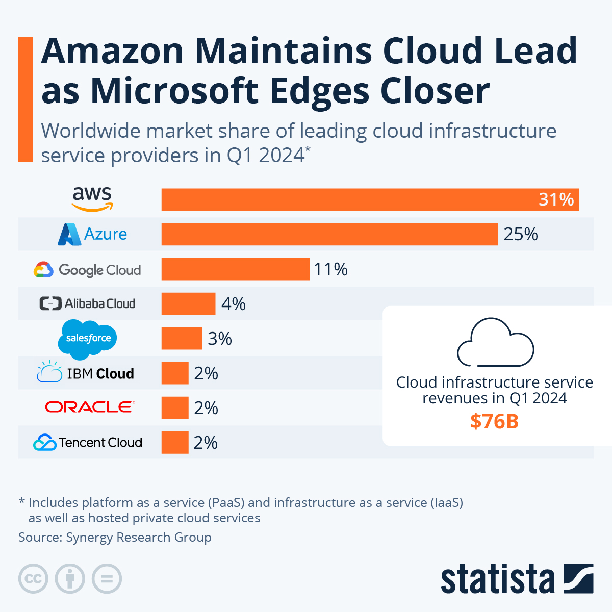

## Introduction to Cloud

### What is cloud computing?
A delivery of IT resources and tools via the "cloud", an internet-based service that allows for any and all storage of tools and content to be delivered to those requesting access with high speed. It is an alternative to (or works in co-existence with) a physical data centre, which contains servers that can in theory ramp up in price from purchase and maintenance faster than a cloud service - depending on the cloud service though, this can be still expensive, so a customer will need to make an informed decision [1].

### How do we know if something is in the cloud?
Since the cloud is web-based, every cloud application will involve a connection to the internet. This isn't to say that every web-based application is on the cloud, but the cloud does require internet to function correctly. An easy trick to figuring out if something is cloud-based is if the service can be used in exactly the same way just as easily via a different device. For example, YouTube is a cloud-based social media, as all of your data is stored online and it can be accessed with little-to-no problems (on a good day) on your phone, your laptop, your television and so on. The same is often true with email clients like Outlook [2].

### The difference between "on-premises" and cloud
On-premises software ("on-prem") is a term to simply mean it is software that is hosted via local means. If a business has on-premises software, it means hardware such as servers are stored on-site, and are used in day-to-day work with only a local connection to the infrastructure needed. The cloud is simply just off-site and not within the business' owned space - rather, it is stored on a provider's servers and accessed via the internet [3],[4].

### Cloud deployment models
Where the infrastructure for the cloud computing deployment is situated and who has permissions to access and potentially modify this is how a cloud deployment model is grouped. There are 4 models typically identified; public clouds, private clouds, community clouds (also known as multi-cloud) and hybrid clouds. All four have different uses that make them viable for various scenarios, so deciding on which one is important before a business fully embraces cloud computing. 

- Public Clouds - entirely managed by an external service provider. These were the first type of deployment model made and are constantly referenced under "cloud" when it is being referenced, so it is likely the type the majority of people are most familiar with. Very good value and offer a lot of availability that would otherwise be unachievable if a business was only storing their data on-site, but this can be a hit-or-miss, along with how likely faults are to occur. Always ensure that you are working with cloud services that match your requirements. Public cloud deployment allows for a great deal of scalability without the need for the business themselves to expand their own storage. Public clouds however can also have forced downtime, as the provider of the cloud also deems when the servers are taken down for fixing, plus the provider also deems when an upgrade is needed, negotiations will have to be made. Security is also very difficult to ensure, as the provider has control and a view of the security, so you need to have a semblance of trust.

- Private Clouds - managed and maintained by the business that is using the cloud, controlled by a cloud-based data centre. So long as the data centre is on-demand and accessed via the internet, the concept of a private cloud is completely acceptable. They are very good for fixing problems, as the business can access it directly, rather than through a provider. The business also helps control the upgrades that the cloud service will have. However, the costs are considerably higher compared to public clouds. The business also needs to ensure that all of the servers are maintained by experts, a knowledge of all of the components of a cloud work environment will be of the utmost necessity.

- Community Clouds - the "least-known" type of cloud model to the public, community clouds allow for the sharing of a cloud workspace for multiple businesses, designed to help the companies work together to achieve something that wouldn't be as easy (if at all possible) with separate cloud services. This makes the cost of maintaining a community cloud much more affordable than private clouds, as the server infrastructure can be more complex, but shared price-wise across multiple companies. This also allows for companies to share different expertise in maintaining the cloud, unlike in private where a single business will need to have experts that can cover all sections of the cloud. However, if not properly communicated there are issues with ownership and security. For instance, what parts of the cloud are owned by one business and the other parts by another? Can you trust the other company to treat the data within the cloud with sensitivity and how can you protect confidential information?

- Hybrid Clouds - Rather than being a single cloud with both private and public parts, a hybrid cloud is an overall cloud structure which holds various private and public clouds within it. A hybrid cloud allows for a lot more flexibility, and is likely to be a popular format in the future; however, it must be addressed that hybrid clouds will of course be expensive, as well as being difficult to set up different rules and regulations for each cloud environment within the hybrid. If you also need to move data from a private cloud to a public cloud (or vice versa), the result will also be a large use of bandwidth to get the data between these points.

[5]

### ...As A Service

- Software as a Service (SaaS) - where every component of the server architecture a business has is on the cloud and managed by others.
- Platform as a Service (PaaS) - applications and data are kept in the business' control, but the rest of the components (runtime, middleware, servers, storage, etc.) are kept on the cloud and managed by others
- Infrastructure as a Service (IaaS) - Virtualisation, Servers, Storage and Networking are on the cloud controlled by others, the rest of the components are business jobs. [6]

### The benefits and drawbacks of the cloud

A business can get many great benefits from the cloud, including but not limited to a cheaper cost (than managing everything on-premises), a greater amount of scalability if going public (you can choose the storage needed) and perhaps most importantly there is a better chance of recovery after a critical loss (if you lose a lot of data, the cloud systems help back it up, so there is a better chance the work lost is able to be maintained unscathed, though of course there are still chances of complete loss). Some drawbacks include a lack of control (mainly with public cloud deployment models) and the obvious necessity for an internet connection. Also, if not enough thought is given into a contract with a cloud provider, the result could be catastrophic for the work and costs of the server. The business should always check what they are buying into [7].

### OPEX and CAPEX
- OPEX: Stands for OPerating EXpenses, and is related around the "business as usual" costs that would come into business operations. The cloud, for example, would likely fall under OPEX for when it is fully running after purchase and set-up, performing the tasks the business needs it to. These costs the cloud would have on a business will result in great benefits in the short-term.
- CAPEX: Stands for CAPital EXpenditures, the result of any long-term investments made with a business' money to potentially end up with an overall profit over time. For the cloud, this would likely fall under the purchase or upgrade of a cloud infrastructure. This is greatly beneficial to the business so long as the cloud service purchased is considered well. Always make sure to make an informed decision [8].

### The truth of cloud cost
As previously written, the cloud service chosen can be cheaper, so long as the requirements for it are met. A contract can have fees where the business might not expect, so it is always important to ensure these are checked over before finalising a cloud service. Also, a cloud service could be considerably more expensive if a private model is chosen for the business which, while definitely having great benefits, could result in severely large costs through purchase and maintenance. It is important to always make a wise choice in the cloud model chosen also for this reason. It could, sometimes easily, end up more expensive than on-premises infrastructure.

### Market Share
Within a certain market, a business' market share is the amount of revenue made by that business when compared to the revenue made in the entire market (including this business and its competitors). In terms of the cloud computing market, Amazon is in the lead with Amazon Web Services as of quarter 1 2024, with Microsoft's Azure starting to close the gap somewhat. In third place is Google Cloud.

Picture from Statista [9].

#### Sources
[1] https://aws.amazon.com/what-is-cloud-computing/

[2] https://blog.dropbox.com/topics/work-culture/what-is-the-cloud

[3] https://easy-software.com/en/glossary/on-premises/

[4] https://www.cleo.com/blog/knowledge-base-on-premise-vs-cloud

[5] The Basics of Cloud Computing (2014), Derrick Rountree and Ileana Castrillo, Chapter 3: Cloud Deployment Models

[6] https://www.bmc.com/blogs/saas-vs-paas-vs-iaas-whats-the-difference-and-how-to-choose/

[7] https://www.securestorageservices.co.uk/article/11/pros-and-cons-of-cloud-storage

[8] https://blog.deiser.com/en/differences-capex-and-opex

[9] https://www.statista.com/chart/18819/worldwide-market-share-of-leading-cloud-infrastructure-service-providers/

